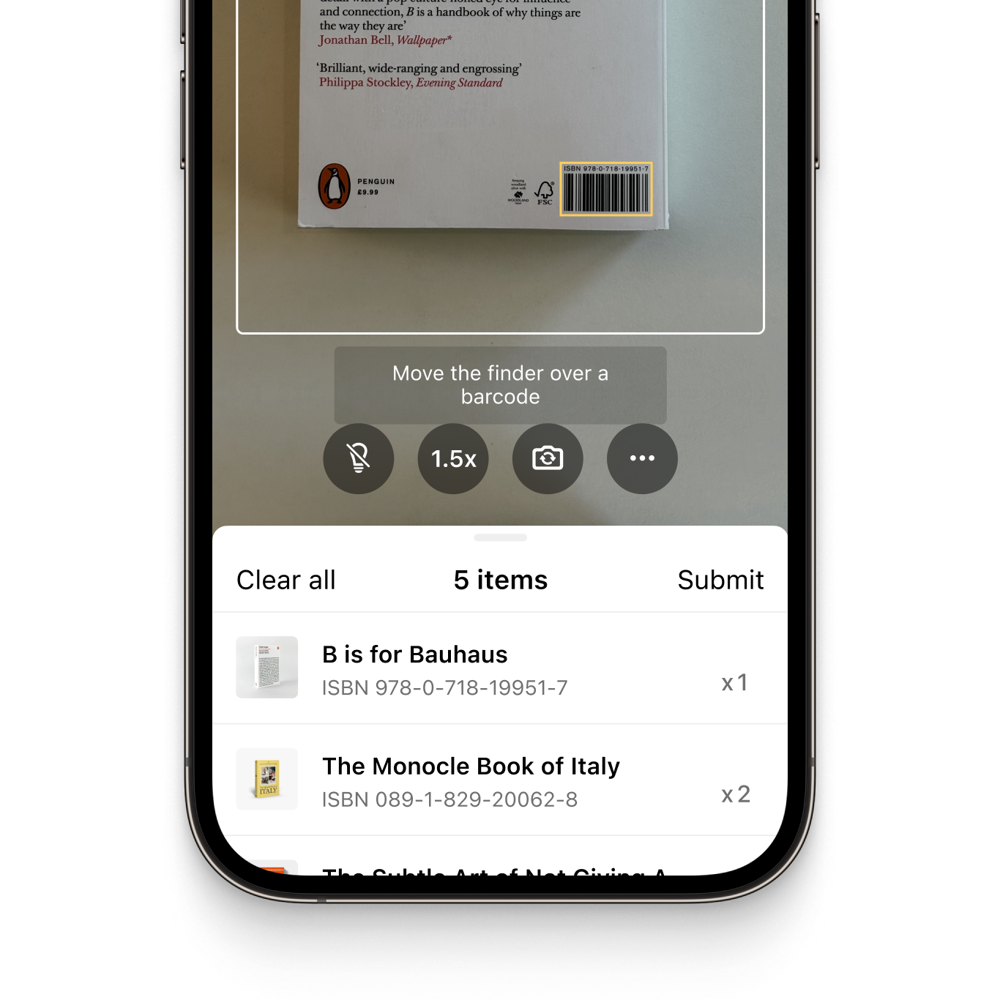
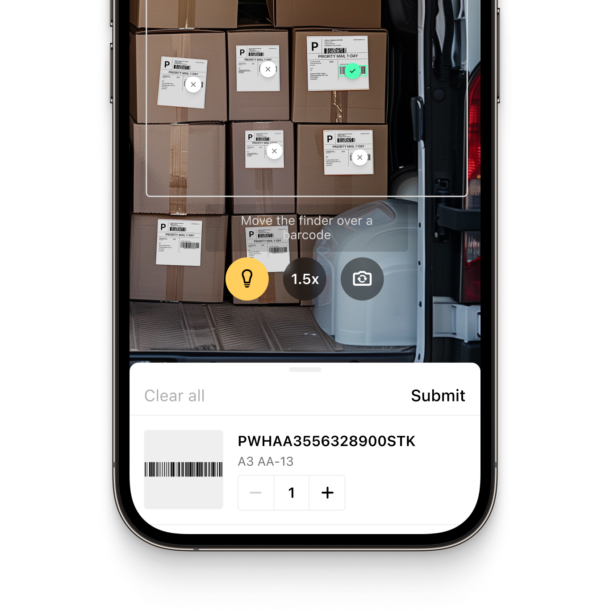

<p align="left">
  
</p>
<p align="left">
  
</p>

# Example App for the Scanbot React Native Barcode Scanner SDK

This example app demonstrates how to integrate the Scanbot Barcode Scanner SDK into your React Native app.

## What is the Scanbot Barcode Scanner SDK?

The Scanbot [Barcode Scanner SDK](https://scanbot.io/barcode-scanner-sdk/?utm_source=github.com&utm_medium=referral&utm_campaign=dev_sites) is a set of simple and intuitive high-level APIs that allows you to integrate fast and reliable barcode scanning into your iOS or Android application.

The SDK utilizes your device's camera, which can be freely switched. You can also apply various filters to narrow down the results by barcode type or content, with regex pattern support to ensure you only capture the specific barcodes relevant to your application.

It operates entirely offline on the user's device and takes only 0.04 seconds per scan. Scans are accurate even under challenging conditions, including damaged, small, or distant barcodes and low-light environments.

The SDK can be integrated into your app within minutes and comes with Ready-To-Use UI components, which allow you to customize the barcode scanner to your needs.

💡 For more details about the Scanbot Barcode Scanner SDK for React Native, please check out our [documentation](https://docs.scanbot.io/react-native/barcode-scanner-sdk/introduction/?utm_source=github.com&utm_medium=referral&utm_campaign=dev_sites).

## How to run the example app

### Step 1: Set up Environment

> **Note**: Make sure you have completed the React Native [Set Up Your Environment](https://reactnative.dev/docs/set-up-your-environment) guide before proceeding.

### Step 2: Install Dependencies

To install the project dependencies, run the following commands

```bash
# Install the required dependencies
yarn install

# OR using npm
npm install
```

For iOS, remember to install the CocoaPods dependencies on the first clone and after updating native dependencies.

The first time you create a new project, run the Ruby bundler to install CocoaPods itself:

```
bundle install
```

Then, and every time you update your native dependencies, run:

```
cd ios 
bundle exec pod install
```

### Step 2: Start your Application

Connect your physical device via USB and run the following command to start your Android or iOS app:

#### For Android

```
# Using yarn
yarn android

# OR using npm
npm run android
```

#### For iOS

```
# Using yarn
yarn ios

# OR using npm
npm run ios
```

If everything is set up correctly, you should see your new app running on your device.

This is not the only way to launch your app. You can also run it directly from within Android Studio and Xcode, respectively.

#### What else can go wrong?

**Pod not found**

```bash
cd ios
bundle exec pod repo update
```

**Still at a loss? It is probably a cache issue**

```bash
yarn run clean
```

* `npm cache clean --force && watchman watch-del-all`
* Restart the metro server!

## Features of the React Native Barcode Scanner SDK

### Out-of-the-box barcode scanning workflows

The Scanbot Barcode Scanner SDK offers the following scan modes right out-of-the-box, in our ready-to-use UI:

#### Single Scanning

This is the default barcode scanning mode. It is optimized for detecting a single barcode at a time and is easily configurable to your needs. You can show a confirmation screen after scanning the barcode.

#### Batch & Multi Scanning

The barcode scanner can also be configured to scan multiple barcodes in succession (without closing the scanning screen each time), to capture multiple barcodes from the device's camera view at once, or to count the scanned items.

#### Find & Pick

Given one or more barcodes, the SDK will visually highlight and scan the correct items for your users. It automatically selects the barcode with the right barcode value from your camera feed.

|  |  |  |
| :-- | :-- | :-- |

### AR Overlay

The Scanbot React Native Barcode Scanner library includes an optional AR Overlay for all scanning modes. It provides real-time barcode highlighting, preview, and tap-to-select functionalities.

Recognized barcodes are highlighted with a customizable frame and text, clearly distinguishing scanned from unscanned items. Users can select barcodes manually by tapping or instead rely on automatic selection.

### Scanning barcodes from an image

The Scanbot SDK also offers barcode scanning for still images, enabling barcode detection from JPG or other image files. It supports single-image and multi-image detection and returns a list with the recognized barcodes.

### Supported barcodes

The Scanbot React Native Barcode Scanner library supports all common 1D- or 2D barcodes and multiple postal symbologies, including:

| Barcode type       | Barcode symbologies                                                                                                                                                                                                                                                                                                                                                                                                                                                                                                                                                                                                                                                                                                                                                                                                                                                                                                                                                                                                                                                                                                                                                                                                                                            |
|:-------------------|:---------------------------------------------------------------------------------------------------------------------------------------------------------------------------------------------------------------------------------------------------------------------------------------------------------------------------------------------------------------------------------------------------------------------------------------------------------------------------------------------------------------------------------------------------------------------------------------------------------------------------------------------------------------------------------------------------------------------------------------------------------------------------------------------------------------------------------------------------------------------------------------------------------------------------------------------------------------------------------------------------------------------------------------------------------------------------------------------------------------------------------------------------------------------------------------------------------------------------------------------------------------|
| 1D Barcodes        | [EAN](https://scanbot.io/barcode-scanner-sdk/ean/?utm_source=github.com&utm_medium=referral&utm_campaign=dev_sites), [UPC](https://scanbot.io/barcode-scanner-sdk/upc/?utm_source=github.com&utm_medium=referral&utm_campaign=dev_sites), [Code 128](https://scanbot.io/barcode-scanner-sdk/code-128/?utm_source=github.com&utm_medium=referral&utm_campaign=dev_sites), [GS1-128](https://scanbot.io/barcode-scanner-sdk/gs1-128/?utm_source=github.com&utm_medium=referral&utm_campaign=dev_sites), [Code 39](https://scanbot.io/barcode-scanner-sdk/code-39/?utm_source=github.com&utm_medium=referral&utm_campaign=dev_sites), [Codabar](https://scanbot.io/barcode-scanner-sdk/codabar/?utm_source=github.com&utm_medium=referral&utm_campaign=dev_sites), [ITF](https://scanbot.io/barcode-scanner-sdk/itf/?utm_source=github.com&utm_medium=referral&utm_campaign=dev_sites), Code 25, Code 32, Code 93, Code 11, MSI Plessey, Standard 2 of 5, IATA 2 of 5, Databar (RSS), GS1 Composite                                                                                                                                                                                                                                                                                                                        |
| 2D Barcodes        | [QR Code](https://scanbot.io/glossary/qr-code/?utm_source=github.com&utm_medium=referral&utm_campaign=dev_sites), [Micro QR Code](https://scanbot.io/barcode-scanner-sdk/micro-qr-code/?utm_source=github.com&utm_medium=referral&utm_campaign=dev_sites), [Aztec Code](https://scanbot.io/barcode-scanner-sdk/aztec-code/?utm_source=github.com&utm_medium=referral&utm_campaign=dev_sites), [PDF417 Code](https://scanbot.io/barcode-scanner-sdk/pdf417/?utm_source=github.com&utm_medium=referral&utm_campaign=dev_sites), [Data Matrix Code,](https://scanbot.io/barcode-scanner-sdk/data-matrix/?utm_source=github.com&utm_medium=referral&utm_campaign=dev_sites) [GiroCode](https://scanbot.io/glossary/giro-code/?utm_source=github.com&utm_medium=referral&utm_campaign=dev_sites), [NTIN Code](https://scanbot.io/glossary/gtin/?utm_source=github.com&utm_medium=referral&utm_campaign=dev_sites), [PPN](https://scanbot.io/glossary/ppn/?utm_source=github.com&utm_medium=referral&utm_campaign=dev_sites), [UDI](https://scanbot.io/glossary/udi/?utm_source=github.com&utm_medium=referral&utm_campaign=dev_sites), [Royal Mail Mailmark](https://scanbot.io/barcode-scanner-sdk/royal-mail/?utm_source=github.com&utm_medium=referral&utm_campaign=dev_sites), MaxiCode |
| Postal Symbologies | USPS Intelligent Mail Barcode (IMb), Royal Mail RM4SCC Barcode, Australia Post 4-State Customer Code, Japan Post 4-State Customer Code, KIX                                                                                                                                                                                                                                                                                                                                                                                                                                                                                                                                                                                                                                                                                                                                                                                                                                                                                                                                                                                                                                                                                                                    |

💡 Please visit our [docs](https://docs.scanbot.io/react-native/barcode-scanner-sdk/supported-barcodes/?utm_source=github.com&utm_medium=referral&utm_campaign=dev_sites) for a complete overview of the supported barcode symbologies.

### Data Parsers

The Scanbot Barcode Scanner SDK supports a variety of data parsers that extract structured information from 2D barcodes such as QR Codes and Data Matrix. These include parsers for documents such as driving licences (AAMVA), boarding passes, medical certificates, SEPA forms, Swiss QR codes and vCard business cards.

💡 Please refer to our [documentation](https://docs.scanbot.io/react-native/barcode-scanner-sdk/supported-barcodes/#data-parsers) for a full list of supported data parsers.

## Additional information

### Guides and Tutorials

Integrating the Scanbot Barcode Scanner SDK into your app takes just a few minutes, and our step-by-step guides make the process even easier. 

Whether you're a seasoned developer or just starting, our tutorials provide clear instructions for adding barcode scanning functionality with minimal effort.

💡Check out our [developer blog](https://scanbot.io/techblog/?utm_source=github.com&utm_medium=referral&utm_campaign=dev_sites) for a collection of in-depth tutorials, use cases, and best practices.

### Free integration support

Need help integrating or testing our Barcode Scanner SDK? We offer [free developer support](https://docs.scanbot.io/support/?utm_source=github.com&utm_medium=referral&utm_campaign=dev_sites) via Slack, MS Teams, or email.

As a customer, you also get access to a dedicated support Slack or Microsoft Teams channel to talk directly to your Customer Success Manager and our engineers.

### Licensing and pricing

The Scanbot SDK examples will run for one minute per session without a license. After that, all functionalities and UI components will stop working. 

To try the React Native Barcode Scanner SDK without the one-minute limit, you can request a free, no-strings-attached [7-day trial license](https://scanbot.io/trial/?utm_source=github.com&utm_medium=referral&utm_campaign=dev_sites).

Our pricing model is simple: Unlimited barcode scanning for a flat annual license fee, full support included. There are no tiers, usage charges, or extra fees.[Contact](https://scanbot.io/contact-sales/?utm_source=github.com&utm_medium=referral&utm_campaign=dev_sites) our team to receive your quote.

### Other supported platforms

Besides React Native, the Scanbot Barcode ScannerSDK is also available on:

* [Android (native)](https://github.com/doo/scanbot-barcode-scanner-sdk-example-android)
* [iOS (native)](https://github.com/doo/scanbot-barcode-scanner-sdk-example-ios)
* [JavaScript (web)](https://github.com/doo/scanbot-barcode-scanner-sdk-example-web)
* [Flutter](https://github.com/doo/scanbot-barcode-scanner-sdk-example-flutter)
* [Capacitor & Ionic](https://github.com/doo/scanbot-barcode-scanner-sdk-example-capacitor-ionic)
* [Cordova & Ionic](https://github.com/doo/scanbot-barcode-scanner-sdk-example-cordova-ionic)
* [.NET MAUI](https://github.com/doo/scanbot-barcode-sdk-maui-example)
* [Compose Multiplatform / KMP](https://github.com/doo/scanbot-barcode-scanner-sdk-example-kmp)
* [Xamarin & Xamarin.Forms](https://github.com/doo/scanbot-barcode-scanner-sdk-example-xamarin)
* [UWP](https://github.com/doo/scanbot-barcode-scanner-sdk-example-windows)
* [Linux](https://github.com/doo/scanbot-sdk-example-linux)
